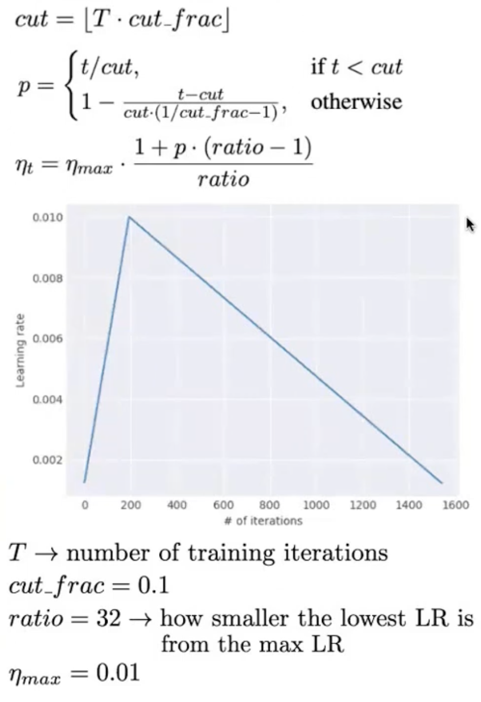
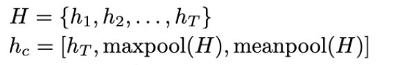

# Universal Language Model Fine-tuning (ULMFiT) for Text Classification

## 1. Motivation 
#### Before inventing universal language model fine-tuning, existing approaches in NLP still require task-specific modifications and training from scratch

#### Q1: What are the disadvantages of those approaches? (hint: time and resource)

## 2. How ULMFit solve above problems
#### ULMFiT is an effective transfer learning method that can be applied to any task in NLP. Transfer learning is a machine learning method where a model developed for a task is reused as the starting point for a model on a second task.

#### The specific logic of applying transfer learning in ULMFiT is pretraining a language model (LM) on a large general-domain corpus and fine-tunes it using the data of target task 
##### 1. Faster only needs to adapt to the idiosyncrasies of the target data
##### 2. Robust LM even for small datasets

## 3. Architecture

#### ULMFiT consists of three stages:
##### 1. General-domain LM pretraining
##### 2. Target task LM fine-tuning
##### 3. Target task classifier fine-tuning

## 3.1 Stage one: General-domain LM pretraining
### In this stage, the LM is trained on a general-domain corpus to capture general features of the language.
#### 1. Wikitext-103 consisting of 28595 preprocessed Wikipedia articles and 103 million words.
#### 2. This stage only needs to be performed once and improves preformance and convergence of downstream models. 
#### 3. The exact model is LSTM (Long Short Term Memory networks), which is a special kind of RNN
##### &ensp;  &ensp;  1. Capable of learning long-term dependencies
##### &ensp;  &ensp;  2. Overcome vanishing gradients and exploding gradients porblems.

## 3.2 Stage two: Target task LM fine-tuning
### No matter how diverse the general-domain data used for pretraining is, the data of the target task will likely come from a different distribution. Thus, we need to fine-tune the LM on data of the target task
### 3.2.a Discriminative fine-tuning
#### 1. Instead of using the same learning rate for all layers of the model, discriminative fine-tuning allows us to tune each layer with different learning rates. 
#### 2. This method is designed to address the issue that different layers capture different types of information and thus, they should be fine-tuned to different extents.

### 3.2.b Slanted triangular learning rates
#### 1. First linearly increases the learning rate and then linearly decays it according to the designed schedule
#### 2. The purpose of this method is to make the model quickly converge to a suitable region of the parameter space in the begining of training and then adapt its parameters to task-specific features. 

## 3.3 Stage three: Target task classifier fine-tuning
### Augment the pretrained language model with two additional linear blocks. Each block uses batch normalization and dropout, with ReLU activations for the intermediate layer and a softmax activation that outputs a probability distribution over target classes at the last layer.

### 3.3.a Concat pooling
#### 1.The signal in text classification tasks is often contained in a few words, which may occur anywhere in the document. Thus, instead of only considering the last hidden state of the model, we need to consider representation from all states. 

### 3.3.b Gradual unfreezing
#### Rather than fine-tuning all layers at once, which risks catastrophic forgetting, it proposes to gradually unfreeze the model starting from the last layer

## 4.Critical Thinking

## 5. Resource Links
#### 1. LSTM https://arxiv.org/abs/1708.02182
#### 2. Different layers capture different types of information https://arxiv.org/abs/1411.1792
#### 3. Slanted triangular learning rates https://ieeexplore.ieee.org/document/7926641
